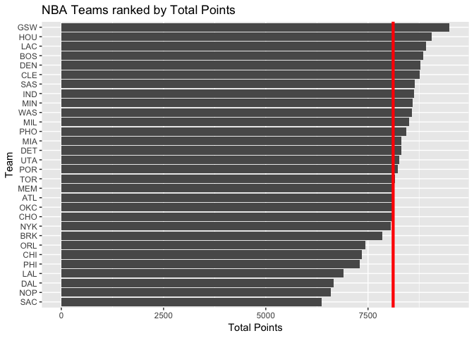

workout1-Youngeun-Kim
================
Youngeun Kim

``` r
library(ggplot2)
library(dplyr)
```

    ## 
    ## Attaching package: 'dplyr'

    ## The following objects are masked from 'package:stats':
    ## 
    ##     filter, lag

    ## The following objects are masked from 'package:base':
    ## 
    ##     intersect, setdiff, setequal, union

``` r
teams <- read.csv("../data/nba2018-teams.csv")
```

``` r
ggplot(teams, aes(x=reorder(team, salary), y=salary)) + geom_bar(stat='identity') + coord_flip() + labs(y = "Salary(in millions)", x = "Team", title = "NBA Teams ranked by Total Salary") + geom_hline(aes(yintercept = mean(salary)), colour = "red", size = 1.5)
```


``` r
ggplot(teams, aes(x=reorder(team, points), y=points)) + geom_bar(stat='identity') + coord_flip() + labs(y = "Total Points", x="Team", title = "NBA Teams ranked by Total Points") + geom_hline(aes(yintercept =  mean(points)), colour = "red", size = 1.5)
```



``` r
ggplot(teams, aes(x=reorder(team, efficiency), y=efficiency)) + geom_bar(stat='identity') + coord_flip() + labs(y = "Total Efficiency", x="Team", title = "NBA Teams ranked by Total Efficiency") + geom_hline(aes(yintercept =  mean(efficiency)), colour = "red", size = 1.5)
```


``` r
ggplot(teams, aes(x=reorder(team, experience), y=experience)) + geom_bar(stat='identity') + coord_flip() + labs(y = "Total Experience", x="Team", title = "NBA Teams ranked by Total Experience") + geom_hline(aes(yintercept =  mean(experience)), colour = "red", size = 1.5)
```


``` r
# I wanted to see if there are more veteran player who have more game experience have high possibility to win the match
```

Comments and Reflections
------------------------

#### Was this your first time working on a project with such file structure? If yes, how do you feel about it?

no

#### Was this your first time using relative paths? If yes, can you tell why they are important for reproducibility purposes?

no

#### Was this your first time using an R script? If yes, what do you think about just writing code (without markdown syntax)?

no

#### What things were hard, even though you saw them in class/lab?

data preparation

#### What was easy(-ish) even though we haven’t done it in class/lab?

plotting graphs

#### Did anyone help you completing the assignment? If so, who?

yes my GSI helped me a lot and ggplt cheat sheet info are helpful &lt;3

#### How much time did it take to complete this HW?

3 hours

#### What was the most time consuming part?

data preparation

#### Was there anything interesting?

everything was interesting
